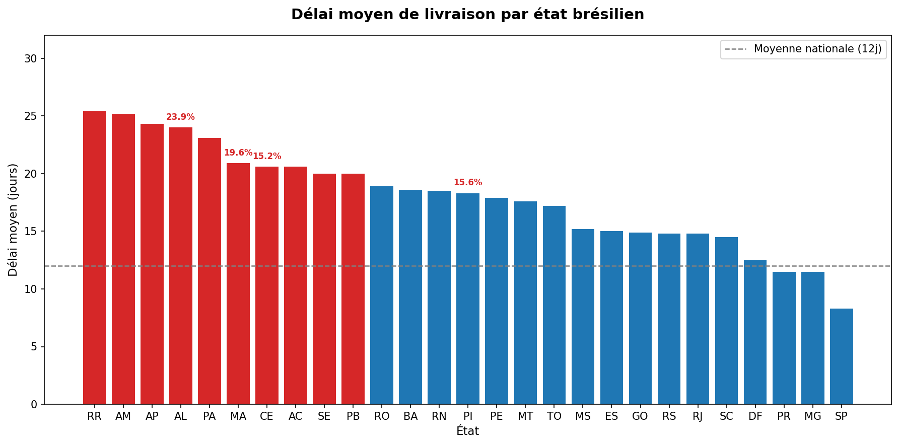

# Analyse des livraisons Olist E-Commerce

Analyse de 96 000+ commandes réelles de la plateforme brésilienne Olist
pour identifier les problèmes de performance logistique par région et dans le temps.

## Résultats clés

- **Délai moyen de livraison : 12 jours** sur 96 427 commandes livrées
- **8,1% des commandes arrivent en retard** par rapport à la date promise
- **Les états du nord livrent 2x plus lentement** : RR, AM, AP moyennent 25 jours vs 12 nationalement
- **AL (Alagoas) est la pire région** : 24 jours de délai moyen ET 23,9% de taux de retard
- **Pic de mars 2018** : taux de retard à 21,4% — la logistique n'a pas suivi la croissance des volumes
- **Novembre 2017** : 14,3% de retard — probablement la pression du Black Friday

## Délai de livraison par état



## Architecture du pipeline
CSV bruts (Kaggle)
↓
extract.py   → chargement et jointure commandes + clients
↓
transform.py → nettoyage, calcul delivery_days, is_late, order_month
↓
load.py      → chargement dans SQLite via SQLAlchemy
↓
analyze.py   → requêtes SQL répondant aux 3 questions métier
↓
visualize.py → graphique matplotlib par état

## Stack technique
Python 3.8 · pandas · SQLAlchemy · SQLite · matplotlib

## Lancer le projet

```bash
git clone https://github.com/TONUSERNAME/ecommerce-data-pipeline
cd ecommerce-data-pipeline
pip install -r requirements.txt

python src/extract.py
python src/transform.py
python src/load.py
python src/analyze.py
python src/visualize.py
```

## Source des données
[Olist Brazilian E-Commerce Dataset](https://www.kaggle.com/datasets/olistbr/brazilian-ecommerce)
— 100k commandes réelles, 2016–2018, licence publique.